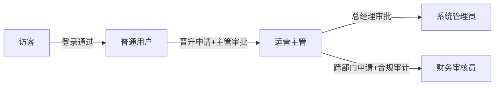

# 附录 B 模板：角色 × 功能 权限矩阵（Permission Matrix）
> 本附录从 L5_DETAIL 阶段产出的 `permission_matrix.json` 自动生成。
> 来源：`knowledge-base/04-graph-schema-v6.md` ROLE 节点权限规范 + `baton.layers.L5.permission_matrix_coverage`（目标 ≥70%）。

## 使用说明
- 每一行 = 一个 FUNCTION（粒度：功能入口按钮级，不是「模块」粗粒度）。
- 每一列 = 一个 ROLE（从 L0_skeleton.json 的 roles 数组取顺序）。
- 单元格值定义：
 - `可` = 可执行（源码中找到 2+ 条证据：路由 roles、@PreAuthorize、菜单 v-if 等）
 - `推` = 推断可执行（只有 1 条证据或聚合推断，仍未达 ≥2）
 - `否` = 不可执行（显式 hasRole 不包含 / 菜单 v-if = false / 后端 Deprecated 等）
 - `查` = 无证据（AUTO_REVIEW 阶段仍无法判定，对应附录 C 中 HUMAN_REVIEW_REQUIRED 节点）

---

## 角色清单

| 角色 ID | 角色显示名 | 描述（从 L0 证据取） | 是否内置管理员级 |
|---------|-----------|--------------------|:---------------:|
| ROLE_001 | | | |
| ROLE_002 | | | |
| ROLE_003 | | | |
| ROLE_004 | | | |

---

## 权限矩阵（按模块分组）

### 模块 1：{{ MODULE_001.name }}

| 功能 ID | 功能名（用户语言，非技术） | ROLE_001 | ROLE_002 | ROLE_003 | ROLE_004 | 证据摘要 |
|---------|-------------------------|:--------:|:--------:|:--------:|:--------:|---------|
| FN_xxx | | | | | | |
| FN_xxx | | | | | | |
| FN_xxx | | | | | | |

### 模块 2：{{ MODULE_002.name }}

| 功能 ID | 功能名 | ROLE_001 | ROLE_002 | ROLE_003 | ROLE_004 | 证据摘要 |
|---------|-------|:--------:|:--------:|:--------:|:--------:|---------|
| FN_xxx | | | | | | |

---

## 覆盖率统计

| 指标 | 数值 | 目标 | 达标？ |
|------|:----:|:----:|:------:|
| FUNCTION 总数 | | — | — |
| ROLE 总数 | | — | — |
| 单元格总数（FN × ROLE） | | — | — |
| `可`+`否` 已确定单元格 | | | |
| 推断单元格 | | — | — |
| 无证据单元格 | | — | — |
| 覆盖率（已确定 + 推断）/ 总 | % | ≥70% | |
| 已确定覆盖率（+）/ 总 | % | ≥60% | |
| 缺口严重度（数 ≥1 记 1） | 个 | 0 | |

---

## 权限流转说明（角色变化时的关键路径）

> 以上流转图为 Snake `SNAKE_0xx 权限晋升链路` 摘要，完整跨模块说明见附录 D。

---

**版本**: v6.2-appendix-B
**最后更新**: 2026-08-11
