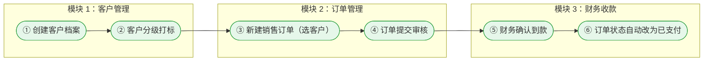
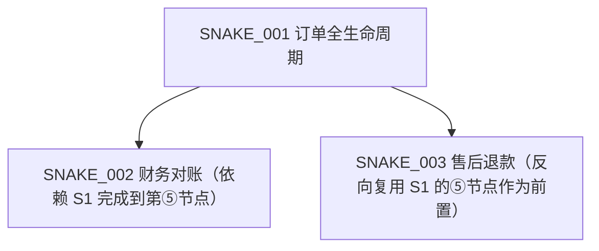

# 附录 D 模板：Snake 跨模块操作全景指南
> 本附录从 `graph/_snakes.json` 自动生成。
> 类型只展开 `end_to_end_flow`（端到端业务流）与 `user_journey`（用户角色旅程）两类；
> `data_propagation`（数据传播）和 `rule_chain`（规则链）如需扩展请修改本模板第 2 节。
> **硬约束**：Snake 数 = 0 → INTEGRATE 阶段阻断（SKILL.md §全局规则 4）。

---

## D.0 Snake 总览

| # | Snake ID | 类型 | 名称 | 跨模块数 | 节点数 | 完整度（complete?） | 负责角色（主要 / 次要） |
|---|----------|------|------|:-------:|:-----:|:------------------:|----------------------|
| 1 | SNAKE_001 | | | | | / | / |
| 2 | SNAKE_002 | | | | | | |
| 3 | SNAKE_003 | | | | | | |

---

## D.1 Snake 独立章节（每条蛇一节）

### D.1.1 {{ SNAKE_001.name }}（{{ SNAKE_001.id }} · end_to_end_flow）

**适用用户**：
**业务场景**：一句话说清这条蛇解决什么真实业务问题（例：客户在系统内从下单→到财务收到款项的完整闭环操作）。
**关联模块**：{{ MOD_001.name }} → {{ MOD_002.name }} → …（按 order 数组展开）
**前置条件**：①登录并具备…角色；②已有…实体记录；③…

#### 全景流程图

#### 分步操作指引（按节点顺序串，跳到对应模块正文时给出链接锚）

1. **① {{ N1.name }}** → 详见「{{ MOD_001.name }} → …」章节（p.XX）
 - 关键角色：
 - 关键字段：
 - 常见误操作：
2. **② {{ N2.name }}** → 详见「{{ MOD_001.name }} → …」
 - …
3. **③ …**

#### 异常与兜底路径

| 节点 | 异常分支 | 发生概率（高/中/低） | 用户应如何处理（写菜单/按钮路径，非技术） | 文档链接 |
|------|---------|:-------------------:|---------------------------------------|---------|
| ④ 订单提交审核 | 审核被驳回（合规原因：客户分级不足） | | | |

#### 对应 Snake 证据溯源（选填，完整明细见附录 E）

| 节点 | 从 graph 抽取的 3 条主要证据（摘要） |
|------|------------------------------------|
| ① | · 路由跳转 `/customers/new`；· saveCustomer API；· 菜单入口「客户→新增」 |
| ② | · autoGrade 后端接口；· 订单提交校验时会读取 grade；· L0 data_creation_chain 要求先分级再下单 |
| … | … |

---

### D.1.2 {{ SNAKE_002.name }}（…同上结构展开）

…（复制 D.1.1 结构，替换 ID 和模块名）

---

## D.2 Snake 之间的依赖关系总览（可选，≥3 条蛇时输出）

---

**版本**: v6.2-appendix-D
**最后更新**: 2026-08-11
