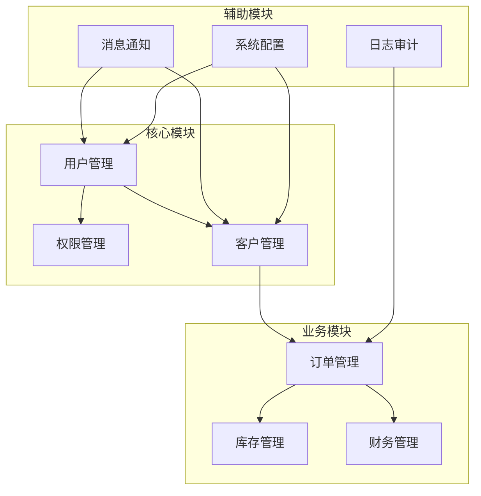
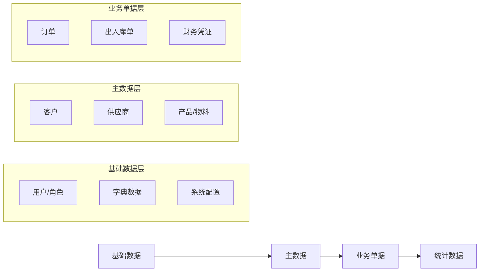
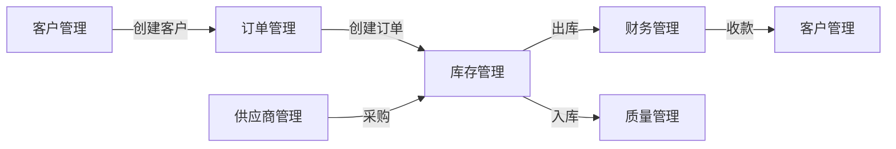
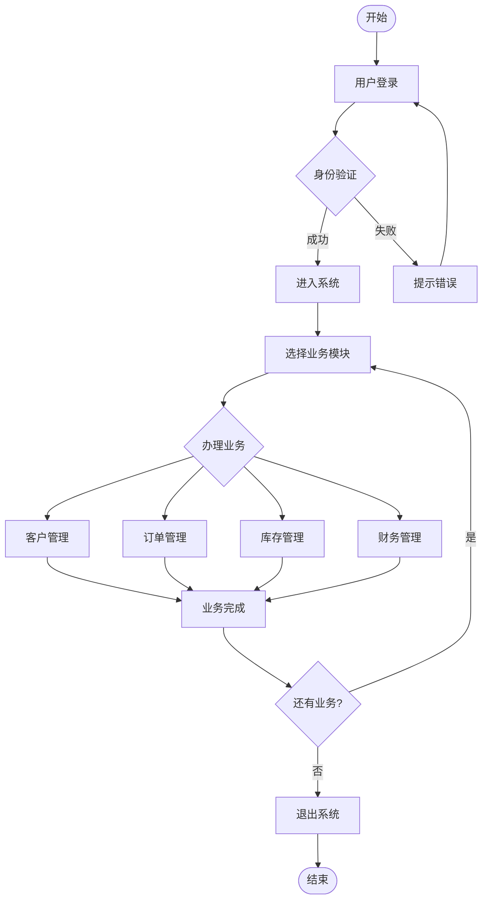

# 标准化探索报告模板 v2.0

这是ManualGen项目探索阶段的标准化输出格式，确保探索结果能够高效传递给后续分析阶段。

## 模板核心原则

1. **结构化输出**: 所有信息必须按标准格式组织，便于程序化处理
2. **完整性优先**: 不遗漏任何关键信息
3. **可追溯性**: 每个发现都有来源依据
4. **可操作性**: 报告必须能够直接指导后续工作

---

## 完整探索报告模板

```markdown
# {系统名称} 项目探索报告

---

## 📋 报告信息

```yaml
report_metadata:
  项目名称: {系统名称}
  探索时间: {YYYY-MM-DD HH:MM:SS}
  探索耗时: {X分钟}
  报告版本: v2.0
  团队规模: {X人}
  项目年龄: {X年X月}
  代码规模: {约XXX行代码}
```

---

## 🏗️ 1. 系统架构概览

### 1.1 架构模式

```yaml
architecture_pattern:
  类型: {单体/微服务/混合}
  分层: {前后端分离/三层架构等}
  
  backend:
    技术栈: [{技术1}, {技术2}]
    服务数量: {N个}
    部署方式: {容器化/传统}
    
  frontend:
    框架: {Vue/React/Angular}
    技术栈: [{技术1}, {技术2}]
    状态管理: {Vuex/Redux等}
    
  database:
    类型: {MySQL/PostgreSQL/MongoDB}
    数量: {N个}
    主从复制: {是/否}
```

### 1.2 技术栈详情

| 层级 | 技术 | 版本 | 用途 |
|------|------|------|------|
| 前端框架 | {Vue3} | {3.2+} | UI开发 |
| 后端框架 | {Spring Boot} | {2.7+} | API服务 |
| 数据库 | {MySQL} | {8.0+} | 数据存储 |
| 缓存 | {Redis} | {6.0+} | 缓存服务 |
| 消息队列 | {RabbitMQ} | {3.9+} | 异步通信 |

---

## 📦 2. 功能模块地图

### 2.1 模块概览

| 序号 | 模块名称 | 类型 | 复杂度 | 文件数 | API数 | 核心功能 |
|------|----------|------|--------|--------|-------|----------|
| 1 | {模块A} | core | 高 | 45 | 12 | {功能1, 功能2} |
| 2 | {模块B} | support | 中 | 23 | 8 | {功能3} |
| 3 | {模块C} | utility | 低 | 12 | 5 | {功能4} |

### 2.2 模块关系图



### 2.3 核心业务域

| 业务域 | 包含模块 | 业务价值 | 数据量估算 |
|--------|----------|----------|------------|
| {域1} | {模块A, 模块B} | {核心业务价值} | {数据量} |
| {域2} | {模块C, 模块D} | {支撑业务} | {数据量} |

---

## 🔗 3. 数据依赖关系

### 3.1 数据创建顺序链

⚠️ **核心！操作手册必须遵循此顺序！**



### 3.2 关键依赖关系表

| 主数据 | 依赖项 | 依赖类型 | 必须先创建 |
|--------|--------|----------|------------|
| 客户 | 客户等级 | 下拉选择 | ✅ |
| 客户 | 负责人 | 下拉选择 | ✅ |
| 订单 | 客户 | 下拉选择 | ✅ |
| 订单 | 产品 | 下拉选择 | ✅ |
| 订单 | 仓库 | 下拉选择 | ✅ |

### 3.3 跨模块业务流程



---

## 👥 4. 用户角色分析

### 4.1 角色清单

| 角色 | 描述 | 主要权限 | 典型操作 |
|------|------|----------|----------|
| 超级管理员 | 系统最高权限 | 所有功能 | 系统配置、权限分配 |
| 运营主管 | 日常运营管理 | 模块管理、数据查看 | 审核、统计、分析 |
| 运营专员 | 业务操作执行 | 基础CRUD | 录入、查询、导出 |
| 客户 | 外部用户 | 有限功能 | 自助下单、查询 |
| 财务 | 财务相关 | 财务模块 | 收款、付款、对账 |

### 4.2 角色-模块权限矩阵

| 角色 | 用户管理 | 客户管理 | 订单管理 | 库存管理 | 财务管理 |
|------|----------|----------|----------|----------|----------|
| 超级管理员 | ✅ | ✅ | ✅ | ✅ | ✅ |
| 运营主管 | 👁️ | ✅ | ✅ | ✅ | 👁️ |
| 运营专员 | ❌ | ✅(自) | ✅(自) | ✅ | ❌ |
| 客户 | ❌ | ❌ | ✅(自) | ❌ | 👁️ |
| 财务 | ❌ | 👁️ | 👁️ | 👁️ | ✅ |

---

## 🔄 5. 核心业务流程

### 5.1 主业务流程图



### 5.2 典型业务场景

#### 场景1: 新客户下单全流程

| 步骤 | 操作 | 涉及模块 | 耗时 | 注意事项 |
|------|------|----------|------|----------|
| 1 | 登录系统 | 认证 | 1分钟 | 检查账号状态 |
| 2 | 创建客户档案 | 客户管理 | 3分钟 | 确保信息完整 |
| 3 | 创建客户联系人 | 客户管理 | 2分钟 | 至少1个联系人 |
| 4 | 创建销售订单 | 订单管理 | 5分钟 | 检查库存 |
| 5 | 审批订单 | 订单管理 | 2分钟 | 金额>1万需审批 |
| 6 | 出库操作 | 库存管理 | 3分钟 | 检查库存数量 |
| 7 | 开具发票 | 财务管理 | 2分钟 | 核对税率 |
| 8 | 收款确认 | 财务管理 | 1分钟 | 检查收款方式 |

---

## 📊 6. 数据量估算

### 6.1 数据规模

| 数据类型 | 当前数据量 | 月增长量 | 数据保留期 |
|----------|------------|----------|------------|
| 用户 | {X条} | {X条/月} | 永久 |
| 客户 | {X条} | {X条/月} | 永久 |
| 订单 | {X条} | {X条/月} | 3年 |
| 库存 | {X条} | - | 实时 |
| 日志 | {X条} | {X条/月} | 6个月 |

---

## ⚠️ 7. 发现与建议

### 7.1 架构建议

| 问题 | 影响 | 建议 |
|------|------|------|
| {问题1} | {影响} | {建议} |
| {问题2} | {影响} | {建议} |

### 7.2 文档优先级

根据探索结果，建议按以下优先级生成文档：

| 优先级 | 模块 | 原因 | 工作量估算 |
|--------|------|------|------------|
| 🔴 高 | {模块A} | 核心业务，用户量最大 | {X小时} |
| 🟡 中 | {模块B} | 重要支撑 | {X小时} |
| 🟢 低 | {模块C} | 辅助功能 | {X小时} |

### 7.3 快速见效点

| 序号 | 优化点 | 预计收益 | 实施难度 |
|------|--------|----------|----------|
| 1 | {优化点1} | {收益} | {难度} |
| 2 | {优化点2} | {收益} | {难度} |

---

## 📁 8. 附加信息

### 8.1 项目文件结构

```
{项目根目录}
├── backend/                 # 后端代码
│   ├── src/
│   │   ├── controller/     # 控制器
│   │   ├── service/        # 服务层
│   │   ├── repository/     # 数据访问
│   │   └── entity/         # 实体类
│   └── pom.xml
│
├── frontend/                # 前端代码
│   ├── src/
│   │   ├── views/         # 页面
│   │   ├── components/     # 组件
│   │   ├── router/         # 路由
│   │   └── store/          # 状态
│   └── package.json
│
├── database/                # 数据库脚本
│   └── migrations/
│
└── docs/                    # 现有文档
    ├── api/
    └── manuals/
```

### 8.2 代码质量指标

| 指标 | 数值 | 说明 |
|------|------|------|
| 代码行数 | {X} | 前后端总计 |
| 测试覆盖率 | {X%} | 单元测试覆盖率 |
| API文档率 | {X%} | 已文档化API占比 |
| 重复代码率 | {X%} | 代码重复度 |

---

## ✅ 9. 下一步建议

基于探索结果，建议按以下顺序执行：

### 9.1 立即执行

1. ✅ 已完成探索
2. ⬜ 开始信息提取（后端+前端并行）
3. ⬜ 开始业务分析

### 9.2 文档生成顺序（默认全量覆盖全部模块，core 仅决定先后）

1. **第一批次**: {模块A}, {模块B}（用户点名/核心模块，先处理）
2. **第二批次**: {模块C}, {模块D}（剩余模块全量补齐，`batches_done==batches_total` 前不得提前收口）
3. **第三批次**: {模块E}, {模块F}（剩余模块全量补齐，不得省略任何模块）

### 9.3 注意事项

⚠️ **重要提醒**:
1. 创建{模块A}前必须先创建{依赖模块}
2. {流程X}涉及多个模块，需要协调操作
3. {数据Y}是基础数据，必须优先维护

---

**报告生成时间**: {时间戳}
**报告版本**: v2.0
**下次建议更新时间**: {建议时间}
```

---

## 使用说明

### 如何使用本模板

1. **初始化**: 将`{xxx}`格式的占位符替换为实际数据
2. **完整性检查**: 确保所有必填字段都已填充
3. **版本控制**: 每次探索后创建新版本报告
4. **关联更新**: 代码变更后更新相关字段

### 与后续阶段的衔接

本报告为以下阶段提供输入：

| 后续阶段 | 使用内容 |
|----------|----------|
| 信息提取 | 文件结构、技术栈、模块清单 |
| 业务分析 | 数据依赖、业务流程、角色权限 |
| 冲突解决 | 多源信息差异识别 |
| 文档生成 | 内容来源、优先级排序 |

---

**版本**: 2.0.0
**最后更新**: 2026-05-15
**维护者**: songzhou
**更新说明**: 新增标准化格式，增强与后续阶段的衔接
