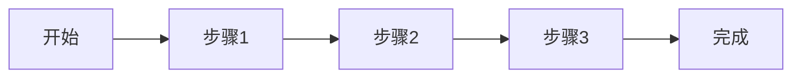
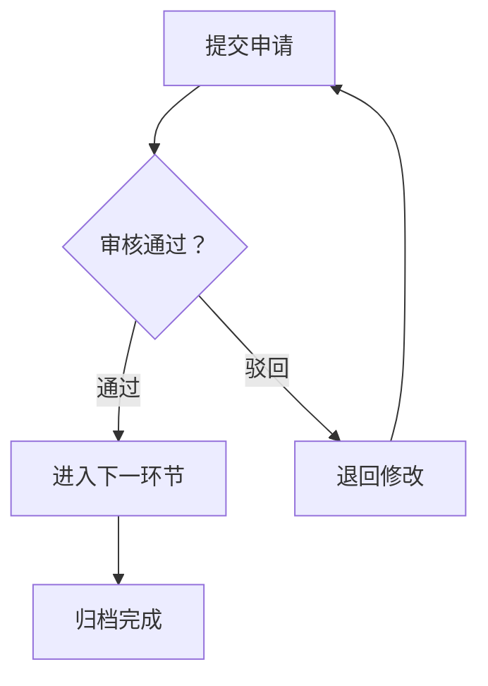
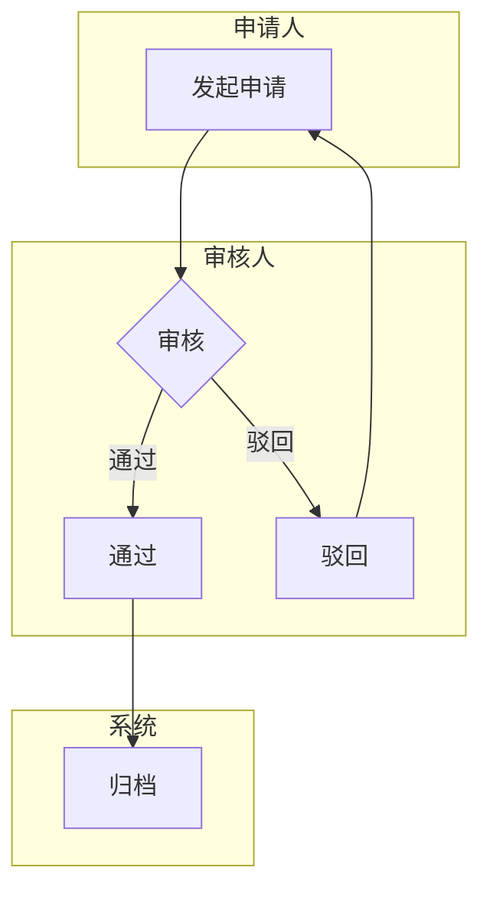

# ManualGen 流程图规范

> 所有操作手册中的流程图必须遵守本规范。流程图是替代截图的唯一方式。

---

## 一、三种流程图类型

### 1. 线性流程图 — 单功能操作

适用场景：单个功能的简单操作步骤，无分支。



规范：
- 节点用 `[]` 方框
- 箭头用 `-->`
- 最多10个节点
- 节点文字用用户语言（非技术术语）
- **节点文字中的中文弯引号必须使用 `「」`**：`A[点击「创建」]` 而不是 `A[点击"创建"]`

### 2. 分支流程图 — 复杂业务

适用场景：包含审批、驳回、异常分支的业务流程。



规范：
- 判断节点用 `{}` 菱形
- 分支标注用 `|通过|` `|驳回|` 形式
- 必须标注正常走向和驳回走向
- 驳回线必须回到上游节点（闭环）

### 3. 泳道流程图 — 跨角色流转

适用场景：多角色参与、跨模块的完整业务流程。



规范：
- 每个角色用 `subgraph` 分泳道
- 泳道名标注角色名称
- 跨泳道箭头必须标注流转条件

---

## 二、流程图通用规范

| 要求 | 说明 | 违规示例 |
|------|------|---------|
| 节点通俗 | 用"提交申请"不用"调用submitAPI"，中文引号用「」 | "POST /api/submit" 或 `A[点击"按钮"]` |
| 链路完整 | 必须包含正常/驳回/终止/异常走向 | 只有正常走向 |
| 标注清晰 | 分支条件、驳回原因必须标注 | 箭头无文字 |
| 闭环完整 | 驳回线必须回到上游节点 | 驳回后无去向 |
| 一一对应 | 每个核心功能必有专属流程图 | 有操作无流程 |

### 节点命名规则

| 节点类型 | 格式 | 示例 |
|---------|------|------|
| 操作节点 | 动词+名词 | `[提交申请]` |
| 判断节点 | 问题形式 | `{审核通过？}` |
| 结束节点 | `[*]` 或 `[完成]` | `[完成]` |

### 禁止行为

- 使用ASCII文字画框图替代Mermaid
- 流程图节点中使用技术术语/API路径
- 遗漏驳回/退回流程（不闭环）
- 一个流程图超过20个节点（应拆分）
- 同一功能有操作步骤但无对应流程图

---

## 三、审核检查点

| 检查项 | 判定标准 |
|--------|---------|
| 格式合规 | 使用 ````mermaid` 开头，非ASCII文字 |
| 节点合规 | 节点文字用户语言，无技术术语 |
| 链路完整 | 含正常+分支+驳回+终止走向 |
| 角色明确 | 跨角色流程需标注角色归属 |
| 覆盖完整 | 每个核心功能都有对应流程图 |
