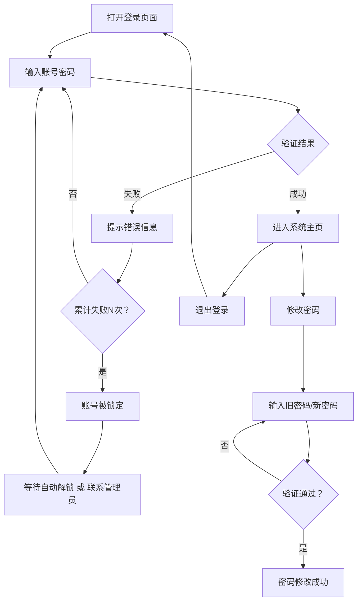
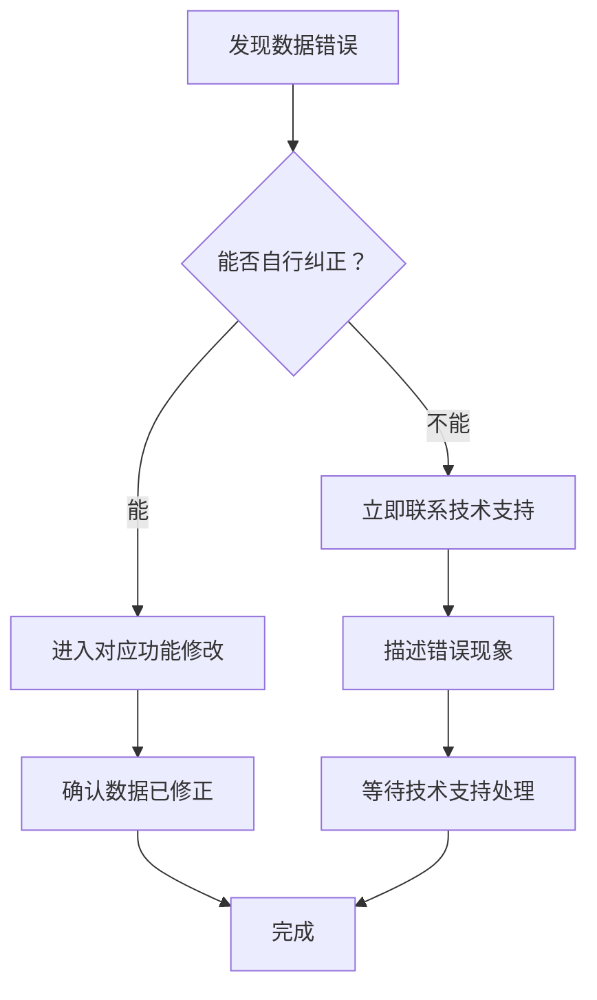
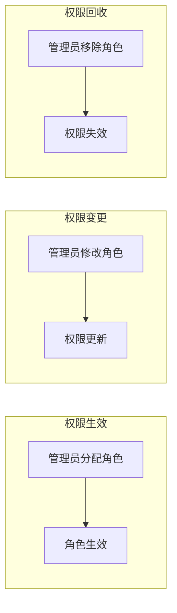
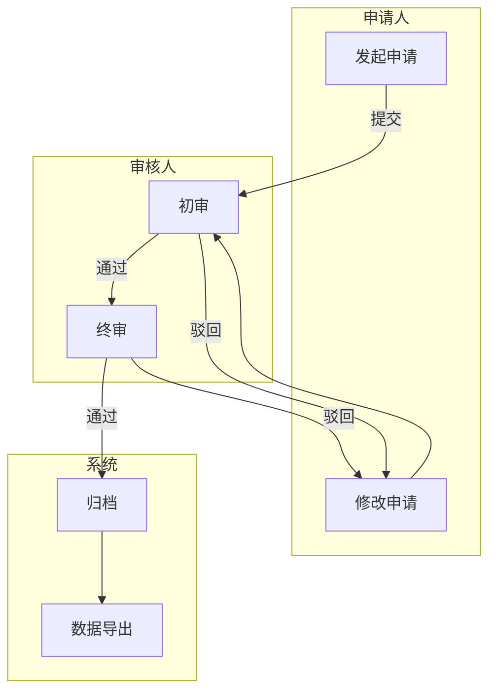

# 普通用户版操作手册模板（User Manual）

> **隐私保护**：本文档必须遵守 [privacy/privacy-notice.md](../privacy/privacy-notice.md) 的隐私规则。严禁包含账号/密码/Token/API Key/隐私数据。
>
> **流程图规范**：本文档中所有流程图必须遵守 [flowchart-spec.md](../templates/flowchart-spec.md) 的规范要求。

这是生成面向**运营人员、销售人员、已购买客户**的操作手册模板，专注于实际操作，不包含任何技术内容。

## 模板核心原则

1. **读者定位**：运营、销售、已购买客户，不是技术人员
2. **操作导向**：每一步都有明确的操作指示
3. **通俗易懂**：不使用技术术语，用日常语言描述
4. **实用优先**：注重操作答疑、注意事项、常见问题

---

## 文档结构规范

### 完整手册结构

```markdown
# {系统名称} 操作手册（用户版）

---

## 文档信息

- 版本: v1.0.0
- 更新日期: {日期}
- 文档类型: 用户操作手册
- 适用范围: 运营人员、销售人员、客户用户
- 覆盖范围: {全量模式 → "覆盖项目全部模块（100%）"；核心优先模式 → "本手册仅覆盖 X 模块，未覆盖 Y、Z（详见附录 F 未覆盖清单）"}

> **查看流程图的方法**：本文档中的业务流程图使用 Mermaid 语法绘制。
> 如果您看不到图形，建议使用以下方式查看：
> - **VS Code**：安装 "Markdown Preview Mermaid Support" 扩展后预览
> - **Typora**：直接用 Typora 打开即可显示
> - **GitHub**：上传到 GitHub 仓库即可自动渲染
> - 所有流程图下方均配有文字说明，不依赖图形也能理解操作路径

---

## 名词释义

> 本文档中的系统专属简称、业务术语和状态标识的统一解释。

| 术语/状态 | 含义 | 说明 |
|-----------|------|------|
| {术语} | {含义} | {说明} |

---

## 目录

## 第一篇 快速入门

1. [系统简介](#1-系统简介)
2. [登录系统](#2-登录系统)
3. [界面导览](#3-界面导览)
4. [通用操作规则](#4-通用操作规则)

## 第二篇 核心功能

5. [模块A - 日常操作](#5-模块a---日常操作)
6. [模块B - 日常操作](#6-模块b---日常操作)

## 第三篇 异常问题与故障处理

7. [常见报错汇总](#7-常见报错汇总)
8. [操作异常处理](#8-操作异常处理)
9. [紧急处理流程](#9-紧急处理流程)

## 第四篇 权限与角色对照

10. [角色权限矩阵](#10-角色权限矩阵)
11. [权限流转说明](#11-权限流转说明)

## 第五篇 全流程业务闭环

12. [全局业务流程图](#12-全局业务流程图)
13. [各环节责任角色](#13-各环节责任角色)

## 第六篇 常见问题

14. [账号与登录](#14-账号与登录)
15. [日常操作答疑](#15-日常操作答疑)
16. [联系我们](#16-联系我们)

## 第七篇 附则与更新说明

17. [系统通用约束](#17-系统通用约束)
18. [手册更新记录](#18-手册更新记录)

---

# 各篇详细内容

[以下各章节包含完整详细内容]

**文档结束**
```

---

## 单个模块用户版模板

> ** 硬性约束 — AI 必须遵守：**
>
> 1. **每个独立操作必须配套 1 个 Mermaid 流程图**（flowchart TD/LR），展示完整操作链路
> - 流程图必须包含：正常走向、分支走向（如有）、退回走向（如有）、终止走向（如有）
> - 流程图节点必须使用用户语言，禁止使用代码/技术术语
> - 禁止使用 ASCII 文字框图代替 Mermaid
> - **节点文字中的中文引号必须用 `「」` 而不是 `""`**：`A[点击「创建知识库」按钮]` 而不是 `A[点击"创建知识库"按钮]`
> 2. **禁止在用户手册中展示任何 API 技术内容**：
> - 禁止：API 端点表格（如 `| POST /api/xxx`）、HTTP 代码示例（如 ````http POST /api/xxx`）、JSON 请求体、Curl 命令
> - 允许：功能说明、操作步骤、字段说明（用户看到的界面字段而非 API 参数）
> - API 参考应放在开发者文档，而非用户操作手册
> 3. **操作步骤必须描述用户在界面上的操作**，而非调用 API 的操作
> - 正确示例："点击【创建知识库】按钮 → 在弹出的对话框中填写名称"
> - 错误示例："调用 POST /api/knowledge-base/ 接口"
> 4. **用户手册中不能出现**：接口路径、HTTP 方法名、状态码、后端服务名、数据库名等技术名词

```markdown
# {模块名称}

## 功能简介

### 这是什么功能？

{用通俗语言描述，一句话说明用途和适用场景}

### 我什么时候需要用到？

| 场景 | 说明 |
|------|------|
| {场景1} | {说明} |
| {场景2} | {说明} |

### 谁能操作这个功能？

| 角色 | 可做什么 | 不能做什么 |
|------|---------|-----------|
| {角色1} | {操作范围} | {限制} |
| {角色2} | {操作范围} | {限制} |

---

## 操作前准备

### 我需要什么权限？

| 权限类型 | 说明 | 如何申请 |
|----------|------|----------|
| {权限1} | {说明} | 联系管理员开通 |
| {权限2} | {说明} | 联系管理员开通 |

### 我需要提前准备什么？

| 准备项 | 说明 | 备注 |
|--------|------|------|
| {准备1} | {说明} | {备注} |
| {准备2} | {说明} | {备注} |

### 前置条件

> 进行此操作前，必须已完成：{前置操作}（详见{相关章节}）

---

## 业务流程图

```mermaid
flowchart TD
 {完整业务流转图，包含：正常流程、分支流程、退回流程、终止流程}
```

**流程说明**（文字版 — 如无法查看流程图请阅读此处）：
- **正常走向**：{描述正常流程路径}
- **分支走向**：{描述分支场景和条件}
- **退回走向**：{描述驳回/退回的处理方式}
- **终止走向**：{描述流程终止条件}

| 节点 | 操作角色 | 说明 | 注意事项 |
|------|---------|------|---------|
| {节点1} | {角色} | {说明} | {注意} |
| {节点2} | {角色} | {说明} | {注意} |

---

## 详细操作步骤

### {操作名称1}

#### 什么情况下做这个操作？

{2-3句话描述使用场景}

#### 操作步骤

**第一步：找到入口**

> 在系统左侧导航栏找到【{模块名称}】菜单
> → 点击【{子菜单}】
> → 进入{目标页面}

**第二步：执行操作**

1. 在页面{位置}找到【{按钮名称}】按钮（外观：{描述}）
2. 点击该按钮
3. 页面出现{变化}
4. 在{位置}的{字段}中填写{内容}
5. 点击【{确认}】按钮

**第三步：确认结果**

- 成功标志：{页面变化}
- 提示信息：{成功提示}
- 后续走向：{数据流转到哪个环节}

#### 字段填写说明

| 字段名称 | 必填 | 填写规则 | 格式要求 | 示例 |
|----------|------|----------|----------|------|
| {字段1} | 是 | {规则} | {格式} | {示例} |
| {字段2} | 否 | {规则} | {格式} | {示例} |

#### 我这样做对吗？

| 正确做法 | 常见错误 | 后果 |
|----------|----------|------|
| {正确} | {错误} | {后果} |

#### 遇到了问题怎么办？

| 问题 | 原因 | 解决方法 |
|------|------|----------|
| {问题1} | {原因} | {解决} |
| {问题2} | {原因} | {解决} |

---

> **风险提示**：{操作名称}为{高危操作类型}，提交后{不可逆/不可撤销/需审核}，请确认无误后再操作。

---

### {操作名称2}

[同上结构]

---

## 注意事项

### 做这个操作时要注意

| 序号 | 注意事项 | 说明 | 后果 |
|------|----------|------|------|
| 1 | {注意事项1} | {说明} | {后果} |
| 2 | {注意事项2} | {说明} | {后果} |

### 这些情况下不能做

| 情况 | 说明 | 替代方案 |
|------|------|----------|
| {情况1} | {说明} | {方案} |
| {情况2} | {说明} | {方案} |

---

## 业务规则

| 规则 | 说明 | 触发了会怎样 | 违反后果 |
|------|------|-------------|---------|
| {规则1} | {通俗说明} | {触发结果} | {后果} |

| 限制项 | 限制内容 | 说明 |
|--------|----------|------|
| {限制1} | {内容} | {说明} |

---

## 常见问题

### Q: {问题1}

**A**: {答案}

### Q: {问题2}

**A**: {答案}

---

## 相关操作

| 相关操作 | 操作入口 | 适用场景 |
|----------|----------|----------|
| {操作1} | {入口位置} | {场景} |
| {操作2} | {入口位置} | {场景} |

---

## 快速参考

| 我想做的 | 菜单位置 | 按钮名称 | 预计时间 |
|----------|----------|----------|---------|
| {操作1} | {位置} | {按钮} | {时间} |
| {操作2} | {位置} | {按钮} | {时间} |
```

---

## 完整手册章节模板

### 第一篇：快速入门

```markdown
# 快速入门

## 1. 系统简介

### 1.1 这是什么系统？

{系统名称}是一个{通俗描述系统功能}的工具。

### 1.2 我能用它做什么？

| 我想... | 系统能帮我... |
|---------|---------------|
| {需求1} | {功能1} |
| {需求2} | {功能2} |
| {需求3} | {功能3} |

### 1.3 使用这个系统需要什么条件？

| 要求 | 说明 |
|------|------|
| 设备 | 电脑或平板（手机暂不支持） |
| 浏览器 | Chrome、Safari、Edge、Firefox最新版 |
| 网络 | 需要连接互联网 |
| 账号 | 由管理员分配账号密码 |

---

## 2. 登录系统

### 2.1 我怎么打开系统？

1. 打开电脑上的浏览器（Chrome/Edge/Firefox/Safari）
2. 在地址栏输入：{系统网址}
3. 按回车键

**我看到了什么？**

> {描述登录页面外观}

### 2.2 我怎么登录？

1. 在【用户名】框中输入：{您的用户名}
2. 在【密码】框中输入：{您的密码}
3. 点击【登录】按钮
4. 首次登录可能需要修改密码

**登录成功了吗？**

- 成功：页面跳转到主界面，显示{欢迎信息/用户名}
- 失败：页面显示{错误提示}，请检查{账号密码是否正确}

### 2.3 登录失败怎么办？

| 问题 | 原因 | 解决方法 |
|------|------|----------|
| 提示"用户名或密码错误" | 账号或密码输入有误 | 重新输入，注意大小写 |
| 提示"账号已锁定" | 多次输入错误 | 联系管理员解锁 |
| 页面打不开 | 网络问题 | 检查网络连接 |

### 2.4 如何修改密码？

1. 点击右上角【{用户名}】
2. 选择【修改密码】
3. 输入旧密码 → 输入新密码 → 确认新密码
4. 点击【确认】
5. 系统提示"密码修改成功"

### 2.5 账号被锁定怎么办？

| 锁定原因 | 解决方法 |
|---------|---------|
| 多次输入错误密码（如连续5次） | 等待{N}分钟后自动解锁，或联系管理员手动解锁 |
| 管理员手动锁定 | 联系管理员了解原因并申请解锁 |

### 2.6 账号操作全流程



---

## 3. 界面导览

### 3.1 我能看到什么？

{系统名称}的主界面包含以下区域：顶部导航栏（LOGO、功能入口、用户名）、左侧菜单栏、中央主工作区。

### 3.2 这些按钮都是什么？

| 位置 | 按钮/区域 | 我点击后会去哪里 |
|------|-----------|------------------|
| 左上角 | {LOGO/系统名称} | 返回首页 |
| 顶部导航 | {功能A} | {功能A的页面} |
| 顶部导航 | {功能B} | {功能B的页面} |
| 右上角 | {用户名} | 个人设置、退出登录 |
| 左上角 | {收起/展开} | 收起或展开侧边栏 |

### 3.3 我想退出登录怎么办？

1. 点击右上角的【{用户名}】
2. 在下拉菜单中选择【退出登录】
3. 页面跳转到登录页面

---

## 常见问题

### Q: 忘记密码怎么办？

**A**: 联系系统管理员，请求重置密码。

### Q: 页面打不开怎么办？

**A**:
1. 检查网络是否正常
2. 尝试刷新页面（按F5或Ctrl+R）
3. 清除浏览器缓存后重试
4. 换用其他浏览器

### Q: 登录后没有看到任何功能菜单？

**A**: 您的账号可能没有分配功能权限，请联系管理员开通权限。

---

**版本**: 1.0.0
**最后更新**: {date}
```

---

### 第二篇：核心功能（模块模板）

```markdown
# {模块名称}

---

## 模块简介

### 这是什么功能？

{用通俗语言描述，1-2句话}

### 我什么时候需要用它？

| 场景 | 说明 |
|------|------|
| {场景1} | {说明} |
| {场景2} | {说明} |
| {场景3} | {说明} |

---

## 操作前准备

### 权限要求

| 权限 | 说明 | 备注 |
|------|------|------|
| {权限1} | {说明} | {备注} |

### 前置条件

| 条件 | 说明 | 如何检查 |
|------|------|----------|
| {条件1} | {说明} | {检查方法} |

---

## 日常操作

### {操作名称}

**适用场景**：{描述什么情况下做这个操作}

#### 操作步骤

**第一步：进入功能页面**

> 依次点击：{菜单路径}
> → 进入{页面名称}

**第二步：执行操作**

1. 在页面{位置}找到【{按钮}】（看起来是{描述}）
2. 点击该按钮
3. 在弹出的{对话框/面板}中填写信息：
 - {字段1}：{填写内容}
 - {字段2}：{选择内容}
4. 点击【{确认}】按钮提交

**第三步：确认成功**

| 成功标志 | 说明 |
|----------|------|
| {标志1} | {说明} |
| {提示信息} | {说明} |

#### 注意事项

| 注意 | 说明 | 后果 |
|------|------|------|
| {注意1} | {说明} | {后果} |

#### 常见问题

**Q: {问题1}**

**A**: {答案}

**Q: {问题2}**

**A**: {答案}

---

## 相关操作

| 您想做的 | 入口位置 | 说明 |
|----------|----------|------|
| {操作1} | {路径} | {说明} |
| {操作2} | {路径} | {说明} |

---

**版本**: 1.0.0
**最后更新**: {date}
```

---

### 第三篇：常见问题

```markdown
# 常见问题

## 1. 账号与登录

### Q: 如何修改密码？

**A**:
1. 点击右上角【用户名】
2. 选择【修改密码】
3. 输入旧密码和新密码
4. 点击【确认】

### Q: 账号被锁定了怎么办？

**A**: 联系系统管理员请求解锁。

### Q: 如何申请新账号？

**A**: 联系系统管理员申请，管理员会分配账号和初始密码。

---

## 2. 日常操作

### Q: 操作时出现错误提示怎么办？

**A**:
1. 仔细阅读错误提示内容
2. 按照提示内容修改后重试
3. 如果无法解决，联系技术支持

### Q: 操作后数据没有保存怎么办？

**A**:
1. 检查页面是否有保存成功的提示
2. 尝试刷新页面查看数据是否已保存
3. 如果确实未保存，重新执行操作

### Q: 想撤销刚才的操作怎么办？

**A**: 大部分操作可以在{位置}找到【撤销】按钮，或者联系管理员协助处理。

---

## 3. 其他问题

### Q: 系统响应很慢怎么办？

**A**:
1. 检查网络连接是否正常
2. 尝试清除浏览器缓存
3. 关闭不必要的后台程序
4. 如果问题持续，联系技术支持

### Q: 需要的功能找不到怎么办？

**A**:
1. 确认您有使用该功能的权限
2. 查看{帮助文档/用户指南}
3. 联系管理员开通权限

---

## 遇到问题找谁？

<!-- TODO:INFO_GAP 技术支持联系方式和业务咨询联系方式需从运维/系统配置文档获取 | 来源: 用户版模板-联系我们 | 依赖: 运维文档审阅完成 -->

> 联系方式将在 TODO_RESOLVE 阶段统一处理。如您有联系方式，请在此补充。

| 联系方式 | 信息 |
|----------|------|
| 技术支持邮箱 | (待补充) |
| 技术支持电话 | (待补充) |
| 工作时间 | (待补充) |

---

**版本**: 1.0.0
**最后更新**: {date}
```

---

### 第四篇：异常问题与故障处理

> 异常处理模板，覆盖常见报错、操作异常、边界场景和紧急处理流程。每个功能模块都应配套此内容。

```markdown
# 异常问题与故障处理

---

## 1. 常见报错汇总

| 报错提示文字 | 产生原因 | 解决方法 |
|-------------|---------|---------|
| {报错提示} | {原因说明} | 1. {步骤1} 2. {步骤2} |
| {报错提示} | {原因说明} | 1. {步骤1} 2. {步骤2} |

---

## 2. 操作异常处理

### 2.1 提交失败

| 失败表现 | 可能原因 | 处理步骤 |
|---------|---------|---------|
| {现象} | {原因} | 1. {步骤1} 2. {步骤2} |

### 2.2 数据加载失败

| 失败表现 | 可能原因 | 处理步骤 |
|---------|---------|---------|
| {现象} | {原因} | 1. {步骤1} 2. {步骤2} |

---

## 3. 边界问题说明

| 场景 | 说明 | 替代方案 |
|------|------|----------|
| 数据不可修改场景 | {什么情况下数据不可修改} | {如何处理} |
| 流程不可回退场景 | {什么情况下流程不可回退} | {如何处理} |
| 系统不支持的操作 | {什么操作不支持} | {替代方式} |

---

## 4. 紧急处理流程

### 4.1 重大数据错误



### 4.2 紧急联系方式

| 场景 | 联系方式 | 响应时间 |
|------|---------|---------|
| 数据错误 | {电话/邮箱} | {时间} |
| 流程卡死 | {电话/邮箱} | {时间} |
| 系统不可用 | {电话/邮箱} | {时间} |
```

---

### 第五篇：权限与角色对照

> 全局角色权限矩阵，替代分散在各模块中的碎片化权限说明。一次查阅即可了解所有角色权限边界。

```markdown
# 权限与角色对照

---

## 角色权限总表

| 角色 | 新增 | 修改 | 删除 | 提交 | 审核 | 导出 | 查看 |
|------|:----:|:----:|:----:|:----:|:----:|:----:|:----:|
| 超级管理员 | 可 | 可 | 可 | 可 | 可 | 可 | 可 |
| {角色2} | 可 | 可 | 否 | 可 | 可 | 可 | 可 |
| {角色3} | 可 | 可 | 否 | 否 | 否 | 可 | 可 |
| {角色4} | 否 | 否 | 否 | 否 | 否 | 否 | 查(仅查看) |

---

## 权限流转说明



> 权限变更后可能需要重新登录才能生效。

---

### 第六篇：全流程业务闭环

> 跨页面、跨角色、跨步骤的全局业务闭环流程图，解决"只会单步操作、不懂整体链路"的问题。

```markdown
# 全流程业务闭环

---

## 全局业务流程图

以下流程图展示{业务名称}的完整流转链路：



---

## 各环节责任角色

| 环节 | 操作节点 | 责任角色 | 流转规则 | 时效要求 |
|------|---------|---------|---------|---------|
| 发起申请 | {页面} | {角色} | {规则} | {时效} |
| 初审 | {页面} | {角色} | {规则} | {时效} |
| 终审 | {页面} | {角色} | {规则} | {时效} |

---

## 常见流转问题

| 问题 | 原因 | 解决方法 |
|------|------|----------|
| 提交后长时间未审核 | {原因} | {方法} |
| 驳回后不知道如何修改 | {原因} | {方法} |
| 流程卡在某个节点 | {原因} | {方法} |
```

---

### 第七篇：附则与更新说明

> 系统约束规则、手册版本管理、常见疑问汇总。确保手册可长期维护。

```markdown
# 附则与更新说明

---

## 系统通用约束

| 约束项 | 说明 |
|--------|------|
| 数据留存规则 | {数据保留多长时间，如：操作日志保留180天} |
| 操作日志说明 | {哪些操作会被记录日志，日志谁可以查看} |
| 系统维护时间 | {每周/每月的维护窗口期} |

---

## 手册更新记录

| 版本 | 更新日期 | 更新内容 | 适配系统版本 |
|------|---------|---------|-------------|
| v1.0 | {日期} | 初始版本 | v1.0 |
| v1.1 | {日期} | {更新内容} | v1.1 |

---

## 常见疑问 Q&A

### Q: {常见问题1}

**A**: {答案}

### Q: {常见问题2}

**A**: {答案}

---

## 手册使用建议

1. 遇到问题时先查阅本文档的【异常问题与故障处理】章节
2. 不确定自己是否有操作权限时，先查看【权限与角色对照】章节
3. 想了解完整业务链路时，查看【全流程业务闭环】章节
```

---

| 模板版本 | 更新内容 | 日期 |
|---------|---------|------|
| v1.0 | 初始模板，覆盖快速入门+核心功能+常见问题 | 2026-05-01 |
| v2.0 | 新增异常处理、权限矩阵、业务闭环、附则等7篇完整结构 | 2026-05-22 |

**版本**: 2.0.0
**最后更新**: 2026-05-22
**模板类型**: 用户版模块文档模板（增强版）
**所属Skill**: ManualGen v5.1.0